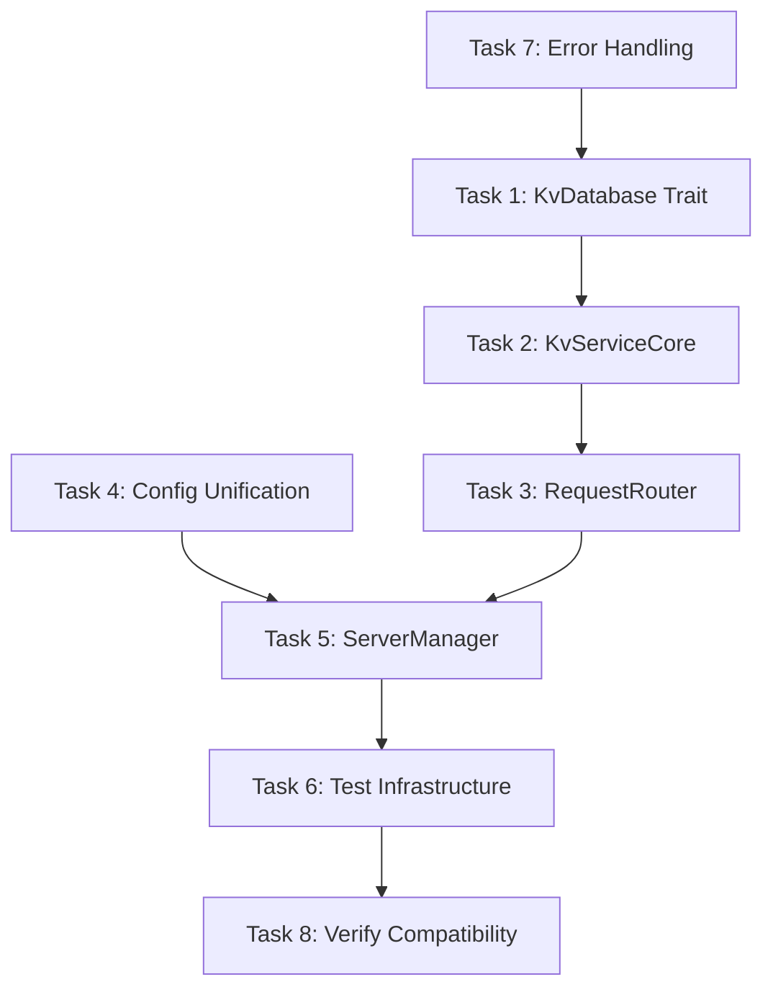

# Phase 0: Strategic Refactoring Plan

## Overview

Phase 0 focuses on refactoring the existing codebase to prevent code duplication when adding replication support. The goal is to create abstractions that allow both standalone and replicated modes to share the same core logic.

## Refactoring Tasks

### Task 1: Create KvDatabase Trait Abstraction
**Priority**: High
**Estimated Time**: 4 hours
**Dependencies**: None

**Files to Modify**:
- Create: `rust/src/lib/db_trait.rs`
- Modify: `rust/src/lib/db.rs`
- Modify: `rust/src/lib/mod.rs`

**Implementation Steps**:

1. **Define the trait** (`rust/src/lib/db_trait.rs`):
```rust
use async_trait::async_trait;
use crate::lib::db::{GetResult, OpResult, AtomicCommitRequest, AtomicCommitResult};

#[async_trait]
pub trait KvDatabase: Send + Sync {
    async fn get(&self, key: &[u8], cf: Option<&str>) -> Result<GetResult, String>;
    async fn put(&self, key: &[u8], value: &[u8], cf: Option<&str>) -> OpResult;
    async fn delete(&self, key: &[u8], cf: Option<&str>) -> OpResult;
    async fn get_range(&self, start_key: &[u8], end_key: Option<&[u8]>, limit: Option<usize>, cf: Option<&str>) -> Result<Vec<KeyValue>, String>;
    async fn atomic_commit(&self, request: AtomicCommitRequest) -> Result<AtomicCommitResult, String>;
    async fn get_read_version(&self) -> u64;
    async fn snapshot_read(&self, key: &[u8], read_version: u64, cf: Option<&str>) -> Result<GetResult, String>;
}
```

2. **Implement trait for existing database** (`rust/src/lib/db.rs`):
```rust
#[async_trait]
impl KvDatabase for TransactionalKvDatabase {
    async fn get(&self, key: &[u8], cf: Option<&str>) -> Result<GetResult, String> {
        // Wrap existing sync method
        tokio::task::block_in_place(|| self.get(key, cf))
    }
    // ... implement other methods
}
```

3. **Add multi-instance support**:
```rust
impl TransactionalKvDatabase {
    pub fn new_with_instance_id(config: Config, instance_id: u32) -> Result<Self, String> {
        let mut config = config;
        config.database.base_path = format!("{}/replica_{}",
            config.database.base_path, instance_id);
        Self::new(config)
    }
}
```

**Testing**:
- Unit tests for trait implementation
- Verify existing functionality unchanged

---

### Task 2: Extract KvServiceCore from Handlers
**Priority**: High
**Estimated Time**: 6 hours
**Dependencies**: Task 1

**Files to Modify**:
- Create: `rust/src/lib/service_core.rs`
- Modify: `rust/src/lib/thrift_handler.rs`
- Modify: `rust/src/lib/service.rs` (gRPC)

**Implementation Steps**:

1. **Create service core** (`rust/src/lib/service_core.rs`):
```rust
use std::sync::Arc;
use crate::lib::db_trait::KvDatabase;
use crate::lib::db::{AtomicCommitRequest, AtomicCommitResult, GetResult};

pub struct KvServiceCore {
    database: Arc<dyn KvDatabase>,
}

impl KvServiceCore {
    pub fn new(database: Arc<dyn KvDatabase>) -> Self {
        Self { database }
    }

    pub async fn get(&self, key: &[u8], cf: Option<&str>) -> Result<GetResult, String> {
        self.database.get(key, cf).await
    }

    pub async fn atomic_commit(&self, request: AtomicCommitRequest) -> Result<AtomicCommitResult, String> {
        self.database.atomic_commit(request).await
    }

    pub async fn get_read_version(&self) -> u64 {
        self.database.get_read_version().await
    }

    pub async fn snapshot_read(&self, key: &[u8], read_version: u64, cf: Option<&str>) -> Result<GetResult, String> {
        self.database.snapshot_read(key, read_version, cf).await
    }
}
```

2. **Refactor Thrift handler** (`rust/src/lib/thrift_handler.rs`):
```rust
pub struct TransactionalKvStoreThriftHandler {
    service_core: Arc<KvServiceCore>,
    verbose: bool,
}

impl TransactionalKvStoreThriftHandler {
    pub fn new(database: Arc<dyn KvDatabase>, verbose: bool) -> Self {
        let service_core = Arc::new(KvServiceCore::new(database));
        Self { service_core, verbose }
    }
}

impl TransactionalKVSyncHandler for TransactionalKvStoreThriftHandler {
    fn handle_atomic_commit(&self, req: AtomicCommitRequest) -> thrift::Result<AtomicCommitResponse> {
        // Convert Thrift types to internal types
        let internal_request = convert_thrift_to_internal(req);

        // Use service core
        let result = tokio::runtime::Handle::current()
            .block_on(self.service_core.atomic_commit(internal_request))
            .map_err(|e| thrift::Error::from(e))?;

        // Convert back to Thrift types
        Ok(convert_internal_to_thrift(result))
    }
}
```

3. **Similar refactoring for gRPC handler**

**Testing**:
- Verify handlers still work with existing tests
- Add tests for service core

---

### Task 3: Implement RequestRouter Pattern
**Priority**: Medium
**Estimated Time**: 4 hours
**Dependencies**: Task 2

**Files to Create**:
- `rust/src/lib/router.rs`

**Implementation Steps**:

1. **Define router trait** (`rust/src/lib/router.rs`):
```rust
use async_trait::async_trait;
use std::sync::Arc;

#[async_trait]
pub trait RequestRouter: Send + Sync {
    async fn route<F, R>(&self, operation: F) -> Result<R, String>
    where
        F: FnOnce(&KvServiceCore) -> BoxFuture<'_, Result<R, String>> + Send,
        R: Send;

    fn is_primary(&self) -> bool;
}

pub struct DirectRouter {
    service_core: Arc<KvServiceCore>,
}

impl DirectRouter {
    pub fn new(service_core: Arc<KvServiceCore>) -> Self {
        Self { service_core }
    }
}

#[async_trait]
impl RequestRouter for DirectRouter {
    async fn route<F, R>(&self, operation: F) -> Result<R, String>
    where
        F: FnOnce(&KvServiceCore) -> BoxFuture<'_, Result<R, String>> + Send,
        R: Send,
    {
        operation(&self.service_core).await
    }

    fn is_primary(&self) -> bool {
        true // Always primary in standalone mode
    }
}
```

2. **Update handlers to use router**:
```rust
pub struct TransactionalKvStoreThriftHandler {
    router: Arc<dyn RequestRouter>,
    verbose: bool,
}

impl TransactionalKvStoreThriftHandler {
    pub fn new_with_router(router: Arc<dyn RequestRouter>, verbose: bool) -> Self {
        Self { router, verbose }
    }
}
```

**Testing**:
- Test DirectRouter implementation
- Verify routing works correctly

---

### Task 4: Unify Configuration System
**Priority**: Medium
**Estimated Time**: 3 hours
**Dependencies**: None

**Files to Modify**:
- Modify: `rust/src/lib/config.rs`
- Modify: `rust/src/servers/shard_node.rs`

**Implementation Steps**:

1. **Add deployment mode to config** (`rust/src/lib/config.rs`):
```rust
use serde::{Deserialize, Serialize};

#[derive(Debug, Clone, Serialize, Deserialize)]
#[serde(tag = "mode", default = "default_mode")]
pub enum DeploymentMode {
    #[serde(rename = "standalone")]
    Standalone,
    #[serde(rename = "replicated")]
    Replicated {
        #[serde(default = "default_replica_count")]
        replica_count: u32
    },
}

fn default_mode() -> DeploymentMode {
    DeploymentMode::Standalone
}

fn default_replica_count() -> u32 {
    3
}

#[derive(Debug, Clone, Serialize, Deserialize)]
pub struct Config {
    #[serde(default = "default_mode")]
    pub mode: DeploymentMode,

    // Existing fields remain
    pub database: DatabaseConfig,
    pub rocksdb: RocksDbConfig,
    // ...

    // Optional replication config
    #[serde(skip_serializing_if = "Option::is_none")]
    pub replication: Option<ReplicationConfig>,
}

#[derive(Debug, Clone, Serialize, Deserialize)]
pub struct ReplicationConfig {
    pub base_port: u16,
    pub primary_replica_id: u32,
}
```

2. **Add environment variable support**:
```rust
impl Config {
    pub fn load() -> Result<Self, Box<dyn std::error::Error>> {
        // Check environment variable first
        if let Ok(mode) = std::env::var("REPLICATED_MODE") {
            if mode == "true" {
                let mut config = Self::load_from_file_or_default()?;
                config.mode = DeploymentMode::Replicated { replica_count: 3 };
                return Ok(config);
            }
        }

        Self::load_from_file_or_default()
    }
}
```

**Testing**:
- Test configuration parsing
- Test environment variable override
- Verify backward compatibility

---

### Task 5: Create ServerManager Abstraction
**Priority**: Low
**Estimated Time**: 4 hours
**Dependencies**: Tasks 1-4

**Files to Create**:
- `rust/src/lib/server_manager.rs`

**Implementation Steps**:

1. **Define trait** (`rust/src/lib/server_manager.rs`):
```rust
use async_trait::async_trait;

#[async_trait]
pub trait ServerManager: Send + Sync {
    async fn start(&mut self) -> Result<(), Box<dyn std::error::Error>>;
    async fn shutdown(&mut self) -> Result<(), Box<dyn std::error::Error>>;
    fn is_healthy(&self) -> bool;
    fn get_status(&self) -> ServerStatus;
}

pub struct ServerStatus {
    pub mode: String,
    pub healthy: bool,
    pub uptime: Duration,
}

pub struct StandaloneServerManager {
    database: Arc<dyn KvDatabase>,
    service_core: Arc<KvServiceCore>,
    router: Arc<DirectRouter>,
    shard_node: Option<JoinHandle<()>>,
    start_time: Instant,
}

impl StandaloneServerManager {
    pub fn new(config: Config) -> Result<Self, Box<dyn std::error::Error>> {
        let database = Arc::new(TransactionalKvDatabase::new(config.database)?);
        let service_core = Arc::new(KvServiceCore::new(database.clone()));
        let router = Arc::new(DirectRouter::new(service_core.clone()));

        Ok(Self {
            database,
            service_core,
            router,
            shard_node: None,
            start_time: Instant::now(),
        })
    }
}
```

2. **Update main function** (`rust/src/servers/shard_node.rs`):
```rust
#[tokio::main]
async fn main() -> Result<(), Box<dyn std::error::Error>> {
    let config = Config::load()?;

    let mut manager: Box<dyn ServerManager> = match config.mode {
        DeploymentMode::Standalone => {
            Box::new(StandaloneServerManager::new(config)?)
        }
        DeploymentMode::Replicated { .. } => {
            // Placeholder for Phase 1
            panic!("Replicated mode not yet implemented");
        }
    };

    manager.start().await?;

    // Wait for shutdown signal
    tokio::signal::ctrl_c().await?;

    println!("Shutting down server...");
    manager.shutdown().await?;

    Ok(())
}
```

**Testing**:
- Test standalone server manager
- Test graceful shutdown
- Test health checks

---

### Task 6: Refactor Test Infrastructure
**Priority**: Low
**Estimated Time**: 3 hours
**Dependencies**: Tasks 1-5

**Files to Create**:
- `rust/tests/common/test_cluster.rs`

**Implementation Steps**:

1. **Create test cluster trait** (`rust/tests/common/test_cluster.rs`):
```rust
use async_trait::async_trait;

#[async_trait]
pub trait TestCluster: Send + Sync {
    async fn start(&mut self) -> Result<(), Box<dyn std::error::Error>>;
    async fn shutdown(&mut self) -> Result<(), Box<dyn std::error::Error>>;
    async fn client(&self) -> KvStoreClient;
    fn get_database_paths(&self) -> Vec<PathBuf>;
    async fn verify_data(&self, key: &[u8], expected_value: &[u8]) -> Result<(), String>;
}

pub struct StandaloneTestCluster {
    manager: StandaloneServerManager,
    client: Option<KvStoreClient>,
}

impl StandaloneTestCluster {
    pub async fn new() -> Result<Self, Box<dyn std::error::Error>> {
        let config = Config::default_test_config();
        let manager = StandaloneServerManager::new(config)?;
        Ok(Self { manager, client: None })
    }
}
```

2. **Create reusable test functions**:
```rust
pub async fn test_basic_operations(cluster: &dyn TestCluster) {
    let client = cluster.client().await;

    // Test SET
    let tx = client.begin_transaction(None, Some(60)).await.unwrap();
    tx.set(b"key1", b"value1", None).await.unwrap();
    tx.commit().await.unwrap();

    // Verify
    cluster.verify_data(b"key1", b"value1").await.unwrap();
}

pub async fn test_atomic_operations(cluster: &dyn TestCluster) {
    let client = cluster.client().await;

    // Test atomic commit
    let ops = vec![
        AtomicOperation::set(b"key2", b"value2"),
        AtomicOperation::set(b"key3", b"value3"),
    ];

    client.atomic_commit(ops).await.unwrap();

    // Verify both keys
    cluster.verify_data(b"key2", b"value2").await.unwrap();
    cluster.verify_data(b"key3", b"value3").await.unwrap();
}
```

**Testing**:
- Run existing tests with new infrastructure
- Verify all tests still pass

---

### Task 7: Add Unified Error Handling
**Priority**: Medium
**Estimated Time**: 2 hours
**Dependencies**: None

**Files to Create**:
- `rust/src/lib/error.rs`

**Implementation Steps**:

1. **Create unified error type** (`rust/src/lib/error.rs`):
```rust
use thiserror::Error;

#[derive(Debug, Error)]
pub enum KvError {
    #[error("Database error: {0}")]
    Database(String),

    #[error("Configuration error: {0}")]
    Config(String),

    #[error("Network error: {0}")]
    Network(String),

    #[error("Consensus error: {0}")]
    Consensus(String),

    #[error("No primary replica available")]
    NoPrimary,

    #[error("Operation timeout")]
    Timeout,

    #[error("Invalid request: {0}")]
    InvalidRequest(String),
}

// Conversions from other error types
impl From<rocksdb::Error> for KvError {
    fn from(e: rocksdb::Error) -> Self {
        KvError::Database(e.to_string())
    }
}

impl From<std::io::Error> for KvError {
    fn from(e: std::io::Error) -> Self {
        KvError::Network(e.to_string())
    }
}

// Conversion to Thrift errors
impl From<KvError> for thrift::Error {
    fn from(e: KvError) -> Self {
        thrift::Error::User(e.to_string())
    }
}
```

2. **Update all Result types to use KvError**

**Testing**:
- Test error conversions
- Verify error messages are preserved

---

### Task 8: Verify Backward Compatibility
**Priority**: High
**Estimated Time**: 2 hours
**Dependencies**: All tasks

**Verification Steps**:

1. **Run all existing tests**:
```bash
cargo test --workspace
```

2. **Test with existing client**:
```bash
# Start refactored server
RUST_LOG=debug cargo run --bin thrift-server

# In another terminal, run existing client tests
cd rust
cargo test --test client_tests
```

3. **Benchmark comparison**:
```bash
# Run benchmarks before and after refactoring
cargo bench
```

4. **Manual testing checklist**:
- [ ] Server starts with default config
- [ ] Server starts with custom config file
- [ ] All Thrift operations work
- [ ] gRPC server still works (if applicable)
- [ ] Client SDK works unchanged
- [ ] C FFI bindings still work

---

## Implementation Order



## Time Estimate

| Task | Estimated Time | Priority |
|------|---------------|----------|
| Task 1: KvDatabase Trait | 4 hours | High |
| Task 2: KvServiceCore | 6 hours | High |
| Task 3: RequestRouter | 4 hours | Medium |
| Task 4: Config Unification | 3 hours | Medium |
| Task 5: ServerManager | 4 hours | Low |
| Task 6: Test Infrastructure | 3 hours | Low |
| Task 7: Error Handling | 2 hours | Medium |
| Task 8: Verify Compatibility | 2 hours | High |
| **Total** | **28 hours** | - |

## Success Criteria

- [ ] All existing tests pass
- [ ] No performance regression (< 5% difference)
- [ ] Server can be started in both modes (standalone works, replicated returns "not implemented")
- [ ] Code duplication metrics show improvement
- [ ] Clean separation between protocol handling and business logic
- [ ] Database abstraction allows multiple instances

## Notes

1. **Async Considerations**: Since existing database is sync, we use `tokio::task::block_in_place` for now. Can optimize later.

2. **Breaking Changes**: None expected. All changes should be internal refactoring.

3. **Future-Proofing**: These abstractions will directly support Phase 1 replication work.

4. **Testing Strategy**: Run tests after each task to catch issues early.

5. **Rollback Plan**: Git commits after each task allow easy rollback if issues arise.