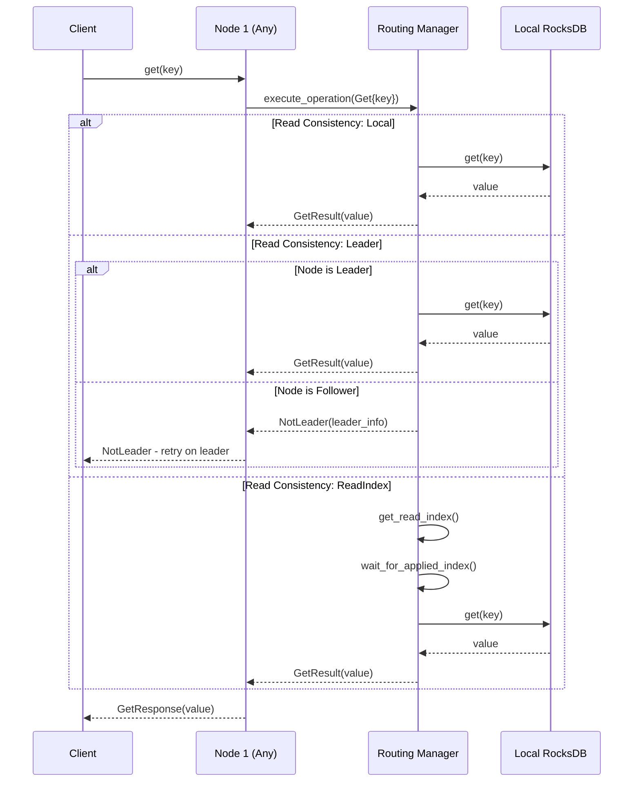
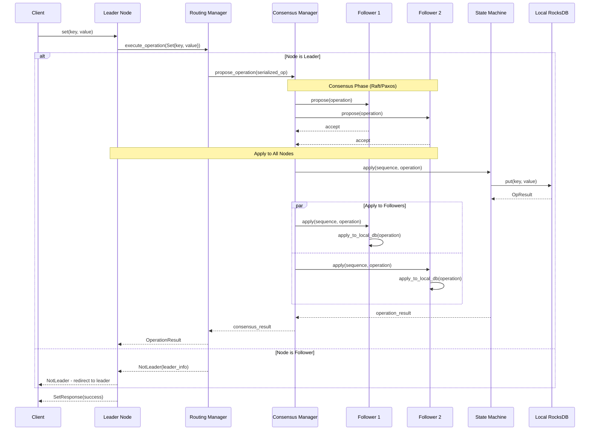

# Multi-Node Architecture for RocksDB Thrift Server

## Overview

This document describes the multi-node architecture of the RocksDB Thrift server. The server is already built as a multi-node capable system with RSML consensus integration, but currently operates in single-node mode within the consensus framework. The architecture separates read and write operations for optimal performance and uses the RSML consensus library for distributed coordination.

## Design Principles

1. **Read/Write Separation**: Reads can be served by any node; writes must go through consensus
2. **Operation-Based Replication**: Individual operations are replicated rather than wrapping the entire database
3. **RSML Consensus**: Uses RSML (Replicated State Machine Library) with Paxos for consensus
4. **Configurable Deployment**: Supports both single-node and multi-node modes via configuration
5. **Backward Compatibility**: Existing clients continue to work without changes

## Architecture Overview

### Core Components and Responsibilities

1. **Operation Classification** (`lib/operations.rs`): Categorizes operations as read-only or write operations using `DatabaseOperation` trait
2. **Routing Manager** (`lib/replication/routing_manager.rs`): Routes operations based on type and consistency requirements; handles read/write separation logic
3. **RSML Consensus Integration** (`third_party/RSML`): Paxos-based consensus library managing leader election and operation replication
4. **KV State Machine** (`lib/kv_state_machine.rs`): Implements RSML StateMachine trait; applies consensus decisions to local database
5. **KV Store Executor** (`lib/replication/executor.rs`): Executes operations on local RocksDB; maintains applied sequence numbers
6. **Thrift Adapter** (`lib/thrift_adapter.rs`): Protocol handler that routes all operations through routing manager
7. **Cluster Manager** (`lib/cluster/manager.rs`): Manages node discovery, health monitoring, and cluster membership

### System Architecture

```
┌─────────────────────────────────────────────────────────────┐
│                    Client Applications                      │
│           (Load balances reads, routes writes to leader)    │
└────────────────────────────┬────────────────────────────────┘
          Reads: Any Node    │ Writes: Leader Only
     ┌─────────────── ───────┼───────────────────────┐
     │                       │                       │
┌────▼─────┐          ┌──────▼────┐            ┌─────▼────┐
│  Node 0  │          │  Node 1   │            │  Node 2  │
│ (Leader) │◄─────────┤ (Follower)│◄───────────┤(Follower)│
├──────────┤Consensus ├───────────┤  Consensus ├──────────┤
│Enhanced  │Messages  │ Enhanced  │  Messages  │ Enhanced │
│ Thrift   │          │  Thrift   │            │ Thrift   │
│ Adapter  │          │ Adapter   │            │ Adapter  │
├──────────┤          ├───────────┤            ├──────────┤
│ Routing  │          │ Routing   │            │ Routing  │
│ Manager  │          │ Manager   │            │ Manager  │
├──────────┤          ├───────────┤            ├──────────┤
│ RocksDB  │          │ RocksDB   │            │ RocksDB  │
└──────────┘          └───────────┘            └──────────┘

Read Flow:  Client ──→ Any Node ──→ Local DB
Write Flow: Client ──→ Leader ──→ Consensus ──→ All Nodes ──→ Local DB
```

### Operation Flow Diagrams

#### Read Operation Flow



#### Write Operation Flow



## Current Implementation Status

### Multi-Node Infrastructure ✅ **COMPLETED**

**All core components for multi-node operation are implemented:**

1. ✅ **Multi-Node Server Architecture** (`servers/thrift_server.rs`)
   - ✅ Configuration-driven deployment mode (standalone vs. replicated)
   - ✅ Node ID assignment and cluster endpoint configuration
   - ✅ Per-node database path management (`./data/multi_node/node_{id}`)
   - ✅ Cluster manager integration with health monitoring and discovery

2. ✅ **Operation Classification System** (`lib/operations.rs`)
   - ✅ Complete `DatabaseOperation` trait with `is_read_only()` and `requires_consensus()` methods
   - ✅ Full `KvOperation` enum covering all Thrift operations (Get, Set, Delete, AtomicCommit, etc.)
   - ✅ Serialization support with Serde for consensus message passing
   - ✅ Comprehensive test coverage for operation routing decisions

3. ✅ **Routing Infrastructure** (`lib/replication/routing_manager.rs`)
   - ✅ Read/write operation separation with configurable consistency levels
   - ✅ Integration with cluster manager for leader discovery
   - ✅ Error handling for `NotLeader` scenarios with redirection
   - ✅ Support for Local, Leader, and ReadIndex consistency modes

4. ✅ **RSML Consensus Integration** (`lib/kv_state_machine.rs`, `third_party/RSML/`)
   - ✅ `KvStateMachine` implementing RSML `StateMachine` trait
   - ✅ `KvStoreExecutor` for applying consensus operations to RocksDB
   - ✅ Full Paxos consensus with proposer, acceptor, learner components
   - ✅ Network layer abstraction supporting both in-memory and TCP transports

5. ✅ **Cluster Management** (`lib/cluster/manager.rs`)
   - ✅ Node discovery and health monitoring
   - ✅ Leader election and failover mechanisms
   - ✅ Inter-node communication infrastructure
   - ✅ Cluster membership and endpoint management

6. ✅ **Configuration System** (`lib/config.rs`)
   - ✅ Complete deployment configuration with `DeploymentMode::Replicated`
   - ✅ Consensus algorithm settings (Paxos via RSML)
   - ✅ Read consistency level configuration
   - ✅ Cluster endpoint and node identity management

### Current Operational Mode ⚠️ **SINGLE-NODE WITHIN CONSENSUS**

**The server runs in single-node mode within the consensus framework:**

- **Consensus Enabled**: RSML consensus components are initialized and operational
- **Single-Node Deployment**: Currently deployed with `replica_endpoints` containing only one node
- **Full Architecture Active**: All multi-node components are running but serve a single node
- **Ready for Scale-Out**: Can be reconfigured to multi-node by updating configuration

### Ready for Production Multi-Node ✅ **ARCHITECTURE COMPLETE**

**What's Working:**
- ✅ Complete multi-node architecture with RSML Paxos consensus
- ✅ Operation classification and routing for read/write separation
- ✅ Cluster management with leader election and health monitoring
- ✅ State machine integration for consensus-based writes
- ✅ Configuration-driven deployment supporting both modes
- ✅ Thrift protocol compatibility maintained

**What's Ready But Not Deployed:**
- ⚠️ **Multi-Node Configuration**: Need configuration files for 3+ node deployment
- ⚠️ **Client Load Balancing**: Client connects to single endpoint (could connect to multiple)
- ⚠️ **Production Testing**: Multi-node integration testing needed

### Deployment Modes Available

**Current: Single-Node in Consensus**
```toml
[deployment]
mode = "replicated"
instance_id = 0
replica_endpoints = ["localhost:9090"]  # Single node

[consensus]
algorithm = "paxos"  # Via RSML
```

**Ready: Multi-Node Cluster**
```toml
[deployment]
mode = "replicated"
instance_id = 0  # Node 0, 1, or 2
replica_endpoints = [
    "localhost:9090",  # Node 0
    "localhost:9091",  # Node 1
    "localhost:9092"   # Node 2
]

[consensus]
algorithm = "paxos"
```

### Next Steps for Multi-Node Deployment

1. **Create Multi-Node Configuration Files**
   - Generate config files for 3-node cluster deployment
   - Configure different ports and database paths per node

2. **Validation Testing**
   - Test 3-node cluster startup and consensus
   - Verify leader election and failover scenarios
   - Validate read/write operation distribution

3. **Client Enhancement** (Optional)
   - Add client-side load balancing across multiple endpoints
   - Implement retry logic for leader redirection
   - Add connection pooling for multi-node clusters

The architecture is complete and ready for multi-node deployment. The current single-node mode demonstrates that all consensus components are operational and the system can scale horizontally by simply updating configuration.